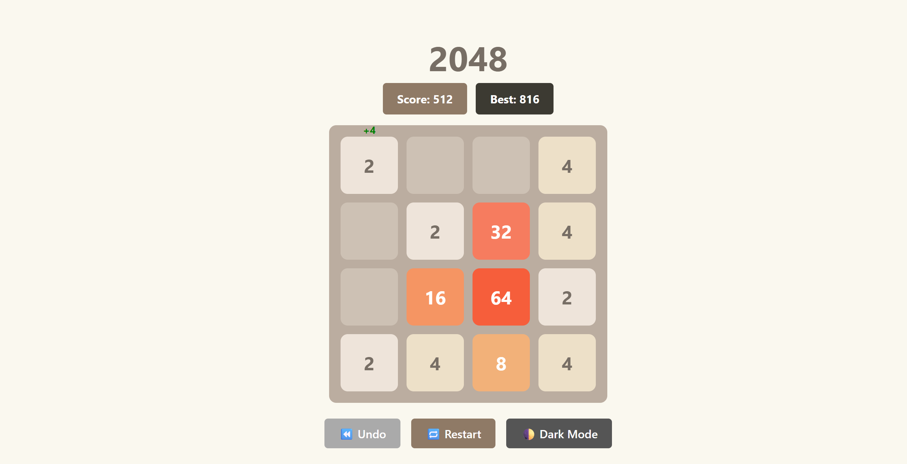

# 🎮 2048 React Game

A modern, smooth, and mobile-friendly version of the 2048 game built using **React + Vite** with professional animations, swipe support, dark mode, and score tracking.

## 🚀 Features

- 🎯 Live Score + Best Score with color indicators
- 🕹️ Undo Last Move
- ♻️ Restart Button (fixed at bottom)
- 📱 Swipe Gesture Support for Mobile (iOS/Android)
- 🌗 Dark Mode Toggle (local storage saves preference)
- 🎨 Tile slide animations, scaling score pop-up effect
- 📏 Fully responsive (mobile/tablet/desktop)
- 💾 Best Score saved with `localStorage`
- 🔁 Smooth transition and state management

---

## 📸 Screenshot

---

## 📦 Tech Stack

- ⚛️ React 18
- ⚡ Vite (build tool)# Stage the files for commit

- 💅 Pure CSS3 (transitions, media queries)
- 📱 Mobile support with `touchstart`/`touchend` handling

---

